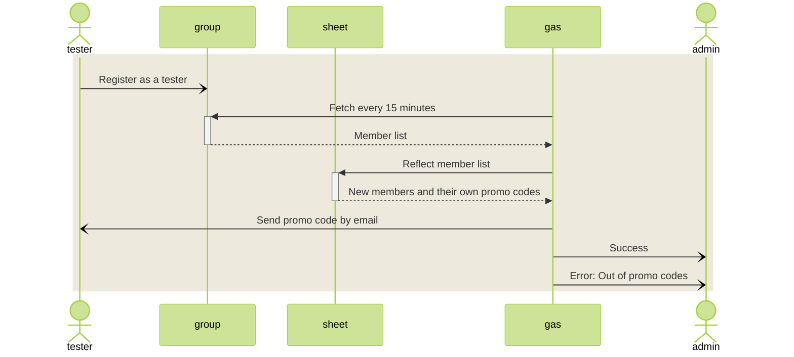
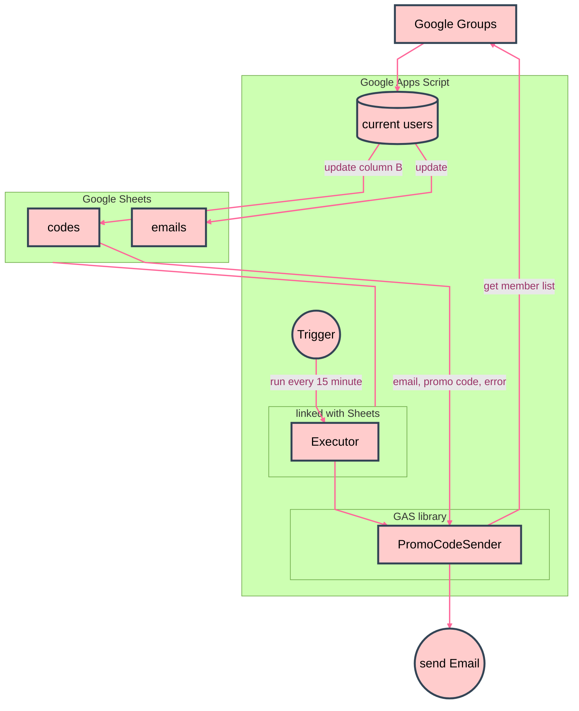

# Automatically Send Promo Codes to New Google Groups Members with GAS

For recruiting closed test participants for paid apps

---

# 🌒️ Introduction

To get an Android app listed on the Google Play Store as an individual developer, you need to recruit 12 beta testers and have them conduct a continuous 14-day test. Since a continuous 14-day work is already illegal labor in my country, you’ll have to rely on volunteers.

With paid apps, testers would have to purchase the app to test it, which seems nearly impossible. However, there’s a workaround: issuing promo codes to make it free. But distributing individual promo codes to all testers is a hassle. To save that effort (and to allow 24/7 registration), I created an automatic sending system.

# 🌕️ Development

## Recruiting Testers

When I learned about the 12-person requirement, I felt defeated, but after some research, I found communities where people help each other recruit testers. I decided to rely on them.

- [How to Quickly Overcome Android Closed Testing](https://zenn.dev/android_tester/articles/f12a1e313fd216)
- [Request for Support for the Android Closed Test Community](https://note.com/yusuke1225math2/n/n5eb506280c20)

As explained above, I used Google Groups to manage participating testers.

## Promo code

- [Use a gift card or gift code - Google Play Help](https://support.google.com/googleplay/answer/3422659)

Enter the code as described above to get a 100% discount and obtain the app for free.

Since each user gets a unique code, distributing them is a hassle. When you issue promo codes, you can download a file with codes listed row by row. I thought of a system where you paste these into column A of a Google Sheet and send them automatically.

## Objective

### What I want to do

### Mechanism

## GAS

With Google Apps Script (GAS), you can easily do cloud-like things for free.

- [Apps Script](https://script.google.com/home)

Create a project and write JavaScript-like code (not full-featured), and within certain limits, you can run it on GCP. Since you can use APIs linked to Google apps and services, everything needed for this system is available.

- [Gmail](https://developers.google.com/apps-script/reference/gmail/gmail-app)
- [Group](https://developers.google.com/apps-script/reference/groups/group)
- [Sheet](https://developers.google.com/apps-script/reference/spreadsheet/range)
- [running account](https://developers.google.com/apps-script/reference/base/user.html)

This time, since email addresses and promo codes are managed on a Sheet, I created a script linked to the Sheet.

1. Create a new Sheet in My Drive
1. From the menu, go to Extensions -> Apps Script to create a linked project
1. You’ll develop by typing or pasting code in this screen

I also wanted to consider testing multiple apps at the same time. If you place the entire code in each Sheet when using multiple Sheets, maintenance becomes troublesome. By making the common parts into a library and handling the different parts (like app names) in the code attached to each Sheet, you can manage this. The library code is not linked to any specific Sheet, so create it independently from Apps Script Home.

## library

In the Apps Script screen for the library code, open the gear icon (⚙ Project Settings) in the left navigation to see the Script ID. This is the ID used to reference the library externally, so copy it.
In the Apps Script Editor screen on the referencing side, click + in libraries on the left and add the Script ID you just copied. You can then call it by the name you specify as the Identifier.

You can select the Version, with the default being Head. If you deploy and create a version on the library side, you can select that version. It’s recommended to create a stable version by deploying and usually reference that. In urgent, you can temporarily change the library and have only the necessary Sheets reference Head for flexible responses.

## Document Property

Store unique information for each Sheet in the Document Property.

The storage destination is the project where the code is actually written, so in this case, it’s the library. Document Property is maintained separately for each app instance using the code, so you can have different settings for each Sheet.

Keep in mind, you need to not only change the value in the code but also perform an operation to write the changed value.

- [Property Service](https://developers.google.com/apps-script/reference/properties)

## Trigger

Unfortunately, Google Groups does not have triggers.

If there were a trigger that fired on new member registration, things would be much simpler and more efficient. But since it doesn’t exist, we’ll just use a timer to poll.

Open the Apps Script screen for each Sheet’s script, and open the clock icon (⏱ Triggers) in the left navigation to select the startup method. Specify the following to enable timer-based startup:

- Choose which function to run (executePromoCodeSender)
- Choose which deployment should run (Head or deployed version)
- Select event source (change from spreadsheet to Time-driven)
- Select type of time based trigger (set to minutes timer)
- Select minute interval (set to 15 minutes)
- Failure notification settings (optional; I set it to hourly)

## Tossed by the Waves of Quota

When I put it into production, I immediately got an error.

> Exception: Service invoked too many times for one day: groups read.

Apparently, the above error occurred when retrieving the Group member list.

- [Quotas for Google Services](https://developers.google.com/apps-script/guides/services/quotas)

> Groups read  2,000/day

I thought I hadn’t run it 2,000 times yet, but I realized I had repeatedly run it during debugging the previous day. It turns out you need to be careful not to overuse the API during development.

Also, this quota is not based on a calendar day, but on the number of times used in the past 24 hours. After the time period when I repeatedly ran it the previous day passed, I was able to use it again.

## Replenishing Promo Codes

In the codes sheet, column C is used as a sent flag (set to 1 when sent). If you run out of promo codes, a sending error will occur, but the error rows will have a flag of 0, so you can determine they are unsent. Just paste additional promo codes into column A, and on the next run, it will send promo codes for the unsent errors as well.

## Code

- [tiny_tools/promo_code_sender_gas](https://github.com/nyosak/tiny_tools/tree/main/promo_code_sender_gas)
- [PromoCodeSender (for library)](https://github.com/nyosak/tiny_tools/blob/main/promo_code_sender_gas/PromoCodeSender.gs)
- [Executor (for sheet)](https://github.com/nyosak/tiny_tools/blob/main/promo_code_sender_gas/Executor.gs)
- [Library Documentation](https://github.com/nyosak/tiny_tools/blob/main/promo_code_sender_gas/LibraryDocumentation.html)

## Usage

### 1. Create the PromoCodeSender library

- Open Apps Script Home
- Create a new project
- Name it PromoCodeSender or similar
- Paste in [PromoCodeSender.gs](https://github.com/nyosak/tiny_tools/blob/main/promo_code_sender_gas/PromoCodeSender.gs) from GitHub
- Deploy a new version

### 2. Create Executor as the execution Sheet

- Open My Drive
- Create a new Sheet
- Name it Executor or similar
- Add two sheets and name them codes and emails
- In the first row of the codes sheet, enter Promotion code, Email, Sent, Timestamp in columns A, B, C, D
- Paste the prepared promo codes under Promotion code, starting from A2
- From the menu, go to Extensions -> Apps Script to open a new linked project
- Name the project (the name is not linked)
- Paste in [Executor.gs](https://github.com/nyosak/tiny_tools/blob/main/promo_code_sender_gas/Executor.gs) from GitHub
- Add a library reference and enter the Script ID for PromoCodeSender so you can reference it by that name

### 3. Register the Google Group name and other settings

- Open the Executor project and display the code
- Edit the constants in setProperties as needed
    - Be sure to edit APP_NAME and GROUP_EMAIL
    - DISABLE_EMAIL and DISABLE_GROUPS_APP are true (debug mode), so set them to null
- Save and manually run setProperties
- Manually run showProperties to check the settings
- Deploy a new version

### 4. Test

- If you created a new Google Group, only you are registered as the owner
- If you run it manually, you should receive a promo code email
- Open the Executor project
- Manually run executePromoCodeSender
- Check the log displayed on the screen
- Confirm that you receive the email

### 5. Set up the trigger for production

- Open the Executor project
- Add a new trigger
- Set executePromoCodeSender to run at regular intervals
- In the left navigation ≡ Executions, check that it runs at the specified time and review the execution logs

# 🌖️ Conclusion

## References

### Community

- [How to Quickly Overcome Android Closed Testing](https://zenn.dev/android_tester/articles/f12a1e313fd216)
- [Request for Support for the Android Closed Test Community](https://note.com/yusuke1225math2/n/n5eb506280c20)
- [r/AndroidClosedTesting - reddit](https://www.reddit.com/r/AndroidClosedTesting/)
- [Important Things to Always Do When Throwing in GAS](https://qiita.com/Cheap-Engineer/items/da7fc8c54810fe661bde)

### Google

- [Apps Script](https://script.google.com/home)
- [Gmail](https://developers.google.com/apps-script/reference/gmail/gmail-app)
- [Group](https://developers.google.com/apps-script/reference/groups/group)
- [Sheet](https://developers.google.com/apps-script/reference/spreadsheet/range)
- [running account](https://developers.google.com/apps-script/reference/base/user.html)
- [Property Service](https://developers.google.com/apps-script/reference/properties)
- [Quotas for Google Services](https://developers.google.com/apps-script/guides/services/quotas)
- [Create and manage deployments](https://developers.google.com/apps-script/concepts/deployments)
- [Google JavaScript Style Guide](https://google.github.io/styleguide/jsguide.html)
- [Use a gift card or gift code - Google Play Help](https://support.google.com/googleplay/answer/3422659?hl=ja)

### Repository

- [tiny_tools/promo_code_sender_gas](https://github.com/nyosak/tiny_tools/tree/main/promo_code_sender_gas)
- [PromoCodeSender (for library)](https://github.com/nyosak/tiny_tools/blob/main/promo_code_sender_gas/PromoCodeSender.gs)
- [Executor (for sheet)](https://github.com/nyosak/tiny_tools/blob/main/promo_code_sender_gas/Executor.gs)
- [Library Documentation](https://github.com/nyosak/tiny_tools/blob/main/promo_code_sender_gas/LibraryDocumentation.html)
