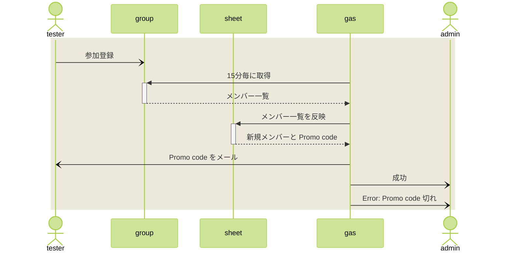
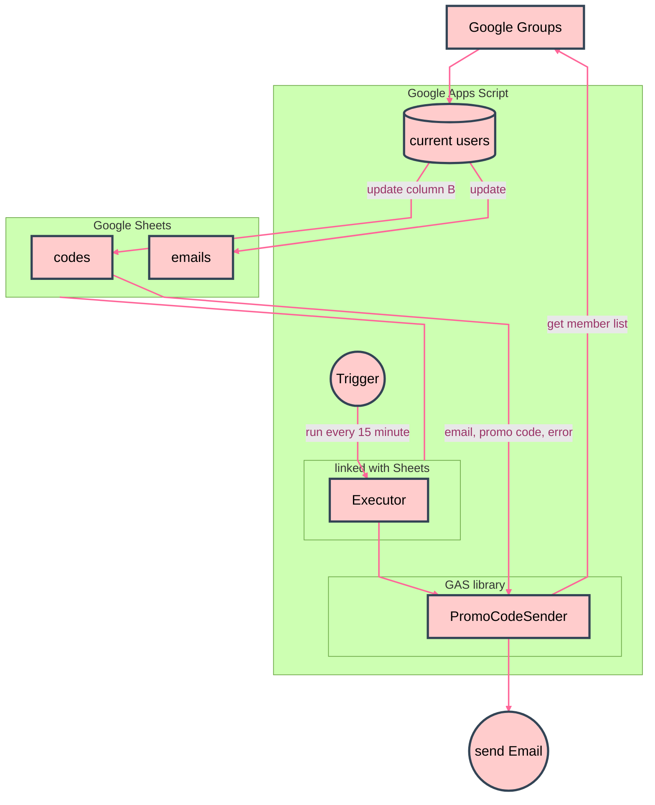

# GAS で Google groups の新規メンバーに Promo code を自動送信する

有料アプリのクローズドテスト要員募集のため

---

# 🌒️ 序

個人開発者が Google Play Store に Android アプリを載せてもらうには、 12人のベータテスターを募集し連続14日のテストを実施してもらわないといけない。連続14日などという時点で、既に違法労働になるので、ここはボランティアにお願いすることになる。

有料アプリだと、テスターにアプリを購入してもらわないとテストできず、ほぼ無理ゲーに見えるのだが、 Promo code 発行で無料にするという裏技がある。ただし、テスター全員に個別に Promo code を配布するという手間がかかる。その手間を惜しむ（というよりは、24時間受付可能にする）ために、自動送信の仕組みを作った。

# 🌕️ 破

## テスター募集

12人と知った時点で終わった感があったのだが、調べてみるとテスター募集したい人が相互テストするようなコミュニティができあがっていて、そちらに助けてもらうことにした。

- [Androidクローズドテストを最速で乗り越える方法](https://zenn.dev/android_tester/articles/f12a1e313fd216)
- [Androidクローズドテストコミュニティへのご支援のお願い](https://note.com/yusuke1225math2/n/n5eb506280c20)

こちらの説明どおり、 Google Groups を使って参加テスターを管理する方法を採った。

## Promo code

- [ギフトカードまたはギフトコードを利用する - Google Play ヘルプ](https://support.google.com/googleplay/answer/3422659?hl=ja)

上記の説明どおりにコードを入力し、アプリの購入を 100%割引で無料にする。

このコードが単一ではなく、ユーザーごとに異なるので、配布が手間になる。 Promo code を発行すると、人数分のコードが行ごとにならんだファイルをダウンロードできる。これを Google Sheets の A列に並べておき、そこから自動送信する仕組みを考えてみた。

## 目論見

### やりたいこと

### からくり

## GAS

Google Apps Script (GAS) を使うと手軽に無料でクラウドっぽいことができる。

- [Apps Script](https://script.google.com/home)

プロジェクトを作り、 JavaScript っぽいコード（フルセットではない）を書けば、一定の制限枠の中とはいえ、GCP で動かせる。 Google のアプリやサービスに連携した API が使えるので、今回のシステムで必要なものがすべて揃う。

- [Gmail](https://developers.google.com/apps-script/reference/gmail/gmail-app)
- [Group](https://developers.google.com/apps-script/reference/groups/group)
- [Sheet](https://developers.google.com/apps-script/reference/spreadsheet/range)
- [running account](https://developers.google.com/apps-script/reference/base/user.html)

今回は、 Sheet 上でメールアドレスと Promo code を管理するので、 Sheet に連携したスクリプトを作る。

1. My Drive で新しい Sheet を作成する
1. メニューから Extensions -> Apps Script と操作すると、連携したプロジェクトが新しく作られる
1. この画面で手入力、ないしコピペというのが、開発スタイルになる

複数アプリを同時にテストすることも考えておきたい。複数の Sheet を使った時に、コード全体をそれぞれに配置したら、コードの維持管理が面倒。共通部分を library にして、 Sheet ごとに違う部分（アプリ名とか）を Sheet に付随するコードで扱うようにする。 library 用のコードは特定の Sheet に連携させないので、 Apps Script Home から単独で新規作成する。

## library

library 用コードの Apps Script 画面で、左側ナビゲーションの歯車（⚙ Project Settings）を開くと、 Script ID が表示されている。それが、 library として外部から参照するときの ID になるので、コピーする。
参照する側の Apps Script の Editor 画面で、左側の libraries の + をクリックして先程コピーした Script ID を追加する。そのときに Identifier として指定した名前でコードから呼び出せる。

Version が選べるようになっていて、デフォルトは Head になっている。 library 側でデプロイを実施してバージョンを作っておくと、当該バージョンを選ぶことができる。デプロイで安定版を作っておき、通常の参照はそちらにするのことをお薦めする。緊急時に library を一時変更し、それを使いたい Sheet だけ Head 参照にする、みたいな機動的な対応ができる。

## Document Property

Sheet ごとの固有情報を、 Document Property に保存する。

保存先は、実際にコードが記載されているプロジェクトになるので、今回のだと library になる。 Document Property は、コードを利用するアプリのインスタンスごと、今の場合だと Sheet ごとに区別して保持されるので、 Sheet ごとに異なる設定値を持つことができる。

ただし、単にコード上で値を変更するだけでなく、変更した値を書き込むという操作が必要。

- [Property Service](https://developers.google.com/apps-script/reference/properties)

## トリガー

残念なことに、 Google Groups はトリガーを持っていない。

もし新規メンバー登録で発火するようなトリガーが利用可能なら、話はもっと単純で省エネルギーで動くのだ。だが無いものは追い求めず、素直にタイマーでポーリング監視をする。

Sheet ごとのスクリプトで Apps Script 画面を開き、左側ナビゲーションの時計（⏱ Triggers）を開くと、起動方法を選択できる。次のものを指定して、時計による起動を有効にする。

- 起動する関数名 (executePromoCodeSender)
- バージョン (Head あるいはデプロイしたバージョン)
- イベント (spreadsheet になっているのを Time-driven にする)
- トリガー (minutes timer にする)
- インターバル (15 minutes にする)
- エラー通知 (お好みで。私は hourly にしている)

## Quota の波に翻弄される

本稼働してみたら、さっそくエラーが飛んできた。

> Exception: Service invoked too many times for one day: groups read.

どうやら、 Group のメンバー一覧を取得するところで上記エラーが出たようだ。

- [Quotas for Google Services](https://developers.google.com/apps-script/guides/services/quotas)

> Groups read  2,000/day

2,000回もまだ動かしてないぞ、と思ったが、ちょうど前日に開発していたとき、デバッグで繰り返し走らせていたことに気づいた。どうやら開発中に API を使いすぎないような工夫が必要だとわかった。

で、この quota だが、1日の区切りというものはなく、直近の 24時間に使った回数で制限がかかっているようだ。前日に繰り返し起動をかけていた時間帯を過ぎると、再び使えるようになった。

## Promo code 補充

codes シートの C列に、送信済みフラグとして 1 を立てている。 Promo code が足りなくなると送信エラーが起きるが、エラー分はフラグが 0 なので、未送信だと判定できる。 A列に追加の Promo code をコピペして補充してやるだけで、次回の起動時にエラー未送信のも含めて、 Promo code を送信してくれる。

## コード

- [tiny_tools/promo_code_sender_gas](https://github.com/nyosak/tiny_tools/tree/main/promo_code_sender_gas)
- [PromoCodeSender (for library)](https://github.com/nyosak/tiny_tools/blob/main/promo_code_sender_gas/PromoCodeSender.gs)
- [Executor (for sheet)](https://github.com/nyosak/tiny_tools/blob/main/promo_code_sender_gas/Executor.gs)
- [Library Documentation](https://github.com/nyosak/tiny_tools/blob/main/promo_code_sender_gas/LibraryDocumentation.html)

## 使い方

### 1. library PromoCodeSender を作成

- Apps Script Home を開く
- 新規プロジェクトを作成
- PromoCodeSender などと名付ける
- GitHub の [PromoCodeSender.gs](https://github.com/nyosak/tiny_tools/blob/main/promo_code_sender_gas/PromoCodeSender.gs) を貼り付ける
- 新しいデプロイを実行

### 2. 実行用 Sheet として Executor を作成

- My Drive を開く
- 新規 Sheet を作成
- Executor などと名付ける
- シートを追加して 2つにし、 codes, emails と名付ける
- codes シートの 1行目 A,B,C,D に、Promotion code,Email,Sent,Timestamp と入力しておく
- Promotion code の下、A2 から下に、用意した Promo code を貼り付けておく
- メニューの Extensions -> Apps Script で、紐付いたプロジェクトを新しく開く
- プロジェクトにも、 Executor などと名前をつけておく（名前は連動しない）
- GitHub の [Executor.gs](https://github.com/nyosak/tiny_tools/blob/main/promo_code_sender_gas/Executor.gs) を貼り付ける
- library の参照の追加を選び、 PromoCodeSender の Script ID を入れて、 PromoCodeSender の名称で参照できるようにする

### 3. 使用する Google Group 名などを登録

- Executor のプロジェクトを開き、コードを表示する
- setProperties 内の定数を必要に応じて修正する
    - APP_NAME, GROUP_EMAIL は必ず修正する
    - DISABLE_EMAIL, DISABLE_GROUPS_APP が true (debug mode) なので null にする
- 保存して、 setProperties を Run で手動実行
- showProperties を Run で手動実行し、設定内容を確認する
- 新しいデプロイを実行

### 4. お試し

- 新規 Google Group を作ったのであれば、自分だけが owner として登録されている
- 手動実行すれば、自分に Promo code メールが飛んでくるはず
- Executor のプロジェクトを開く
- executePromoCodeSender を Run で手動実行
- 画面に表示されるログの内容を確認する
- メールが飛んでくることを確認する

### 5. トリガーを設定して本稼働

- Executor のプロジェクトを開く
- トリガーを新しく追加する
- executePromoCodeSender が一定時間ごとに起動するように設定する
- 左側ナビの ≡ Executions で、所定の時間に起動していることと、その実行ログを確認する

# 🌖️ 急

## 参考資料

### コミュニティ

- [Androidクローズドテストを最速で乗り越える方法](https://zenn.dev/android_tester/articles/f12a1e313fd216)
- [Androidクローズドテストコミュニティへのご支援のお願い](https://note.com/yusuke1225math2/n/n5eb506280c20)
- [r/AndroidClosedTesting - reddit](https://www.reddit.com/r/AndroidClosedTesting/)
- [【備忘録】GASでのthrowで必ずやっておいたほう良いとても重要なお話](https://qiita.com/Cheap-Engineer/items/da7fc8c54810fe661bde)

### Google

- [Apps Script](https://script.google.com/home)
- [Gmail](https://developers.google.com/apps-script/reference/gmail/gmail-app)
- [Group](https://developers.google.com/apps-script/reference/groups/group)
- [Sheet](https://developers.google.com/apps-script/reference/spreadsheet/range)
- [running account](https://developers.google.com/apps-script/reference/base/user.html)
- [Property Service](https://developers.google.com/apps-script/reference/properties)
- [Quotas for Google Services](https://developers.google.com/apps-script/guides/services/quotas)
- [Create and manage deployments](https://developers.google.com/apps-script/concepts/deployments)
- [Google JavaScript Style Guide](https://google.github.io/styleguide/jsguide.html)
- [ギフトカードまたはギフトコードを利用する - Google Play ヘルプ](https://support.google.com/googleplay/answer/3422659?hl=ja)

### レポジトリ

- [tiny_tools/promo_code_sender_gas](https://github.com/nyosak/tiny_tools/tree/main/promo_code_sender_gas)
- [PromoCodeSender (for library)](https://github.com/nyosak/tiny_tools/blob/main/promo_code_sender_gas/PromoCodeSender.gs)
- [Executor (for sheet)](https://github.com/nyosak/tiny_tools/blob/main/promo_code_sender_gas/Executor.gs)
- [Library Documentation](https://github.com/nyosak/tiny_tools/blob/main/promo_code_sender_gas/LibraryDocumentation.html)
